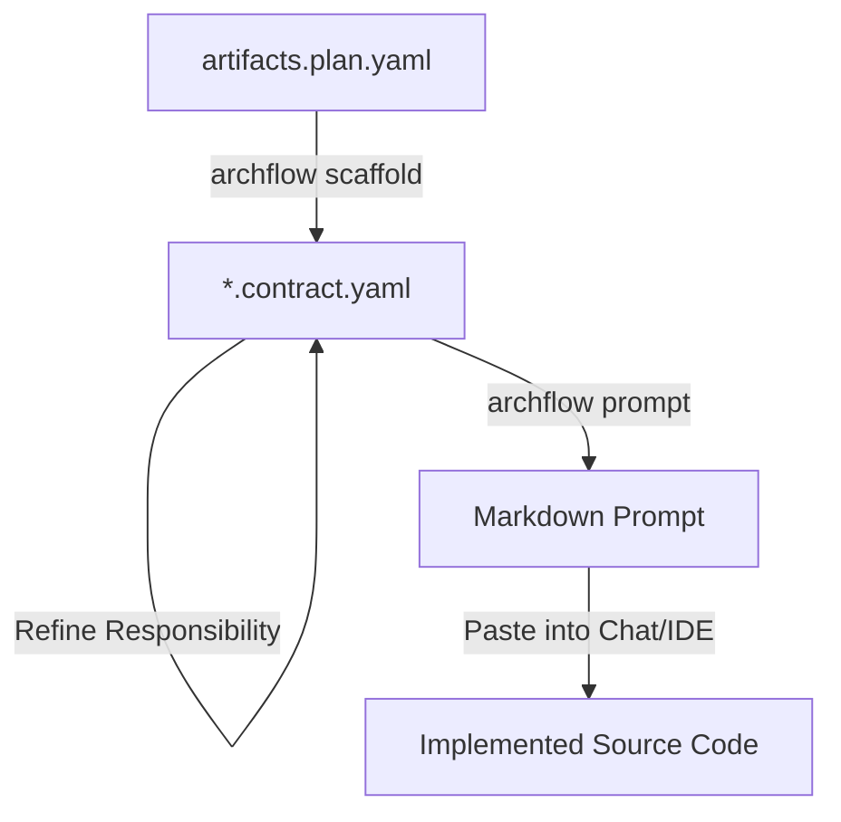

# AI Handoff Flow

The **AI Handoff** is the final stage of the Archflow design process. It transforms structural constraints (Contracts) into actionable instructions (Prompts) for AI coding assistants.

## The Architecture-to-Execution Bridge

Archflow solves the "Context Drift" problem in AI-assisted coding by ensuring that every file an AI creates is governed by a pre-defined contract.



---

## 4-Step Handoff Workflow

### Step 1: Planning
Define your artifacts in `artifacts.plan.yaml`. Associate each artifact with a **Role** (e.g., `entity`, `usecase`, `http_handler`).

### Step 2: Scaffolding
Run `archflow scaffold`. This creates:
1. The **Source Placeholder** (e.g., `user.rs`)
2. The **Contract Sidecar** (e.g., `user.contract.yaml`)

### Step 3: Refinement
Open the generated `.contract.yaml` and refine the:
- **Responsibilities**: What should this specific file do?
- **Must Not**: What logic is strictly forbidden here?
- **Inputs/Outputs**: What is the interface boundary?

### Step 4: Generation
Run the prompt command to get a curated AI instruction set.

```bash
archflow prompt user
```

---

## Smart Role Defaults

Phase 3 introduces **Role-Aware Prompts**. Even if you leave your contract relatively simple, Archflow automatically injects "Completion Criteria" based on the architectural role.

| Role | Default AI Guidance |
| :--- | :--- |
| **`entity`** | Strictly protects domain invariants. No infrastructure leak. |
| **`usecase`** | Coordinates domain but implements zero DB or HTTP logic. |
| **`handler`** | Only translates transport models; embeds zero business rules. |
| **`repository`** | Translates between persistence data and pure domain models. |

---

## Output Modes

Different AI models have different token constraints and verbosity preferences.

### Standard Mode (`--mode standard`)
Best for high-reasoning models (GPT-4, Gemini Pro, Claude 3). Includes full headers and detailed sections.

### Compact Mode (`--mode compact`)
Best for lightweight/fast models or in-editor inline completion. Strips metadata headers and uses comma-separated formatting for dependencies to save tokens.

---

## Example: The "Happy Path"

1. **User runs** `archflow prompt create_user`
2. **Archflow reads** `create_user.contract.yaml`.
3. **Archflow synthesizes** the project context + contract constraints + role defaults.
4. **Output** is a clean Markdown block ready for your favorite LLM.
5. **AI implements** the code strictly within the boundaries of the Archflow `usecase` definition.

---

## 日本語

# AI ハンドオフ・フロー

**AI ハンドオフ**は、Archflow の設計プロセスの最終段階です。構造的な制約（Contract）を、AI コーディングアシスタント向けの実行可能な指示（Prompt）へと変換します。

## アーキテクチャから実装への架け橋

Archflow は、AI による実装における「文脈の乖離（Context Drift）」という問題を、全ての生成ファイルに対して事前に定義された **Contract**（契約）を適用することで解決します。

## 4つのステップ

1. **Planning**: `artifacts.plan.yaml` でアーティファクトを定義。
2. **Scaffolding**: `archflow scaffold` を実行し、ソースのプレースホルダーと Contract ファイル（Sidecar）を作成。
3. **Refinement**: 生成された `.contract.yaml` を磨き上げ、責務や制約を明文化。
4. **Generation**: `archflow prompt` を実行し、AI 用のプロンプトを出力。

## ロールベースの自動最適化 (Phase 3)

アーティファクトの **Role** に応じて、AI が守るべき「完了基準」を自動的に注入します。例えば `entity` ならドメインの不変条件を守ること、`handler` ならビジネスロジックを混ぜないこと、といった指示がプロンプトへ自動的に反映されます。

## 出力モード

- **Standard**: 人間や高性能モデルに適した詳細な Markdown。
- **Compact**: トークン消費を抑えた軽量モデル向けの短縮形式。
